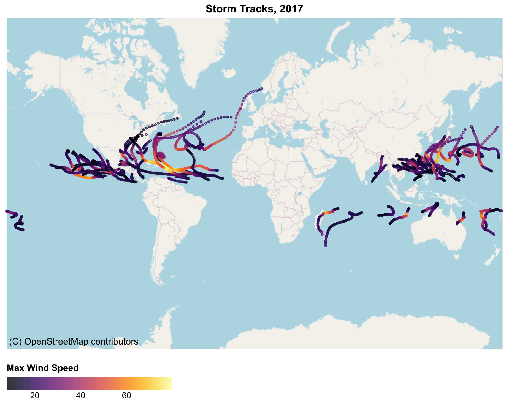
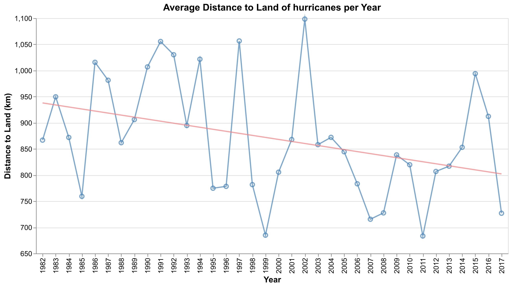

# xarray-tropical-cyclones

A while ago, I used to research atmospheric physics.
Specifically, we found some interesting patterns in tropical cyclone data, including [a shortening of the life cycle of major tropical cyclones](https://agupubs.onlinelibrary.wiley.com/doi/10.1029/2020GL088589), [recent migration of tropical cyclones toward coasts](https://www.science.org/doi/10.1126/science.abb9038), and [more tropical cyclones making landfall with increased intensity](https://www.nature.com/articles/s41598-022-09287-6).

The original code I used was some low-quality pandas stuff.
Given the original [IBTrACS dataset](https://www.ncei.noaa.gov/products/international-best-track-archive) is an `.nc` file, I'll remake the analysis for the landward migration result using `xarray`.

---

There are 13286 storms in (my version of) the dataset.
`uv run python plot_tracks.py` shows the storm tracks across part of 2017.

The distance to land trend (based on the old data I have on my laptop) for hurricanes (tropical cyclones with maximum wind speeds category 1 and above) `uv run python distance_to_land.py`.

